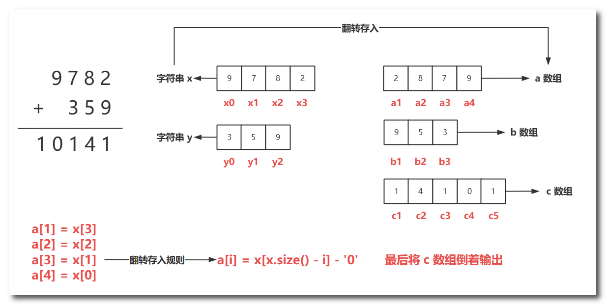

# 一、高精度加法

例题：[P1601 A+B Problem（高精）](https://www.luogu.com.cn/problem/P1601)

算法步骤：



```c++
#include <bits/stdc++.h>
using namespace std;
int a[505], b[505], c[505], la, lb, lc;
void add(int a[], int b[], int c[])
{
	for(int i = 1; i <= lc; i++)
	{
		c[i] += a[i] + b[i]; // 累加
		c[i + 1] += c[i] / 10; // 进位
		c[i] %= 10; // 存余
	}
	if(c[lc + 1] != 0) lc++; // 处理最高位
}
int main()
{
	string x, y;
	cin >> x >> y;
	la = x.size(), lb = y.size(), lc = max(la, lb);
	for(int i = 1; i <= la; i++) a[i] = x[la - i] - '0';
	for(int i = 1; i <= lb; i++) b[i] = y[lb - i] - '0';
	add(a, b, c);
	for(int i = lc; i >= 1; i--) cout << c[i];
	return 0;
}


```

# 二、高精度减法

例题：[P2142 高精度减法](https://www.luogu.com.cn/problem/P2142)


```c++
#include <bits/stdc++.h>
using namespace std;
int a[10090], b[10090], c[10090], la, lb, lc;
void sub(int a[], int b[], int c[])
{
	for(int i = 1; i <= lc; i++)
	{
		if(a[i] < b[i]) // 借位
		{
			a[i] += 10;
			a[i + 1]--;
		}
		c[i] = a[i] - b[i]; // 存差
	}
	while(lc != 1 && c[lc] == 0) lc--;
}
int main()
{	
	string x, y;
	cin >> x >> y;
	if(x.size() < y.size() || (x.size() == y.size() && x < y)) 
		swap(x, y), cout << '-'; // 交换 大减小
	la = x.size(), lb = y.size(), lc = max(la, lb);
	for(int i = 1; i <= la; i++) a[i] = x[la - i] - '0';
	for(int i = 1; i <= lb; i++) b[i] = y[lb - i] - '0';
	sub(a, b, c);
	for(int i = lc; i >= 1; i--) cout << c[i];
	return 0;
}
```

# 三、高精度乘法

# 四、高精度除法
